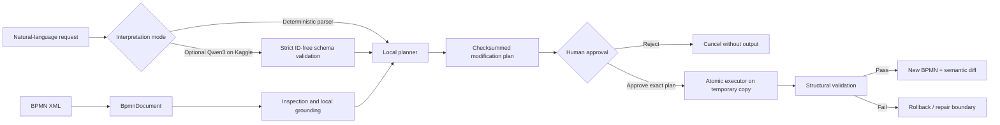

# BPMN Agentic Engineer

> A safety-first Python system for inspecting, analyzing, planning, and applying natural-language changes to BPMN 2.0 process models.


BPMN Agentic Engineer combines natural-language interpretation with a deterministic BPMN engineering core. It can inspect real BPMN XML, locate process elements, analyze graph structure, prepare reviewable modification plans, pause for human clarification or approval, apply an approved plan to a new file, and validate the result.

The core principle is deliberately conservative: **AI interprets intent; trusted local code owns BPMN identifiers, graph facts, XML mutations, and validation.** The original model is never overwritten.

## What it can do

| Area | Current capability |
|---|---|
| Inspection | Summarize processes, participants, lanes, flow nodes, sequence flows, and element-type counts |
| Search | Rank elements by visible name, ID, BPMN type, and lane, with accent-insensitive matching |
| Graph queries | Return predecessors, successors, connecting flows, and directed paths |
| Analysis | Detect structural and process-design signals such as cycles, gateway splits/merges, lane handoffs, duplicate labels, sequential human-task chains, dead ends, and selected lexical signals |
| Planning | Turn English or French requests into checksummed, read-only atomic plans |
| Editing | Insert a task before or after an anchor, rename an element, remove a simple linear element, or replace a consecutive linear task sequence |
| Diagram preservation | Update BPMN-DI shapes and edges for supported transformations, including lane-aware and cross-lane insertion |
| Orchestration | Persist resumable LangGraph runs with clarification, approval, execution, and validation gates |
| Optional LLM | Use Qwen3-8B through a private Kaggle kernel for structured intent interpretation |
| Review | Generate semantic diffs and interactive side-by-side HTML previews with changed elements highlighted |
| Integration | Expose inspection, planning, execution, and durable agent operations through MCP tools |

## How it works



The durable agent follows this stateful sequence:

```text
inspect source
  → interpret request (optional remote Qwen3 step)
  → plan locally
  → clarify if ambiguous
  → wait for explicit approval
  → execute on a copy
  → independently validate
  → complete or stop at the repair boundary
```

LangGraph checkpoints are stored in `.bpmn_agent/checkpoints.sqlite`, allowing a run to stop at an interrupt and resume later by run ID.

## Safety model

The project treats BPMN modification as a controlled engineering operation rather than free-form XML generation.

- The source BPMN is parsed and structurally checked before planning.
- Lane membership comes from standard `flowNodeRef` references, with BPMN-DI geometry as a fallback for exports that omit them.
- The optional LLM receives a compact, ID-free process catalogue and is forbidden from returning BPMN element, lane, process, or sequence-flow IDs.
- Element grounding and ambiguity handling happen locally and deterministically.
- Every executable plan includes a SHA-256 digest of the source and a checksum of the plan itself.
- Execution requires explicit approval of a plan whose checksum still matches.
- A changed source file, modified plan, reused source/output path, or existing output path blocks execution.
- Mutations are first applied to a temporary copy. The destination is committed only after structural validation succeeds.
- Results include resolved generated IDs, validation details, and a semantic before/after diff.

## Supported transformations

The natural-language layer currently maps requests to these bounded operations:

| Operation | Example request |
|---|---|
| Insert after | `After "Review request", add a user task named "Approve request".` |
| Insert before | `Avant "Envoyer le contrat", ajouter une tâche "Valider le contrat".` |
| Rename | `Rename "Review request" to "Validate request".` |
| Remove | `Remove "Archive draft" and reconnect its predecessor to its successor.` |
| Consolidate a linear sequence | `Merge "Enter data" and "Verify data" into "Process data" as a service task.` |

Insertion and removal are intentionally constrained by graph topology. When a target is missing, ambiguous, branched, cross-process, or otherwise unsafe for the requested operation, the planner asks for clarification or refuses to produce an executable plan.

## Installation

### Recommended: `uv`

```bash
git clone <repository-url>
cd bpmn-agentic-engineer-starter
uv venv
uv sync --extra all
```

### Standard `pip`

```bash
python -m venv .venv

# Windows
.venv\Scripts\activate

# macOS / Linux
# source .venv/bin/activate

python -m pip install -e ".[all]"
```

Python 3.10 or newer is required. The base package has no mandatory runtime dependencies beyond the standard library; optional extras add MCP, LangGraph persistence, Kaggle integration, and development tools:

```bash
pip install -e ".[mcp]"    # MCP server
pip install -e ".[agent]"  # LangGraph + SQLite checkpoints
pip install -e ".[llm]"    # Kaggle CLI integration
pip install -e ".[dev]"    # pytest, Ruff, mypy
```

## Quick start: deterministic planning and execution

Inspection and planning do not require an LLM.

```bash
# Inspect a model
bpmn-agent inspect tests/fixtures/execution_process.bpmn --summary-only

# Search for a BPMN element
bpmn-agent find tests/fixtures/execution_process.bpmn "review"

# Build and save a read-only plan
bpmn-agent plan tests/fixtures/execution_process.bpmn \
  "Rename task" \
  --operation rename_element \
  --target-element-id Task_1 \
  --new-name "Validate request" \
  --save-plan output/plans/rename-task.json

# Execute only after reviewing the saved plan
bpmn-agent execute output/plans/rename-task.json \
  output/bpmn/execution_process_modified.bpmn \
  --approved
```

The `execute` command will not overwrite either the source or an existing destination file.

## Durable agent workflow

Use the agent commands when a change may require clarification, a separate approval step, or recovery across processes.

```bash
bpmn-agent agent-start tests/fixtures/ambiguous_processes.bpmn \
  "Rename 'Review request' to 'Validate request'" \
  --output-path output/bpmn/validated-request.bpmn
```

The response contains a `run_id` and stops at either `needs_clarification` or `waiting_for_approval`. Resume the persisted run with the requested information:

```bash
# Disambiguate the process or target
bpmn-agent agent-resume <run_id> --process-id Process_B

# Approve the exact persisted plan
bpmn-agent agent-resume <run_id> \
  --approved \
  --output-path output/bpmn/validated-request.bpmn

# Inspect durable state at any time
bpmn-agent agent-status <run_id>
```

Use `--rejected` or `--cancelled` to stop without execution.

## Optional Qwen3 interpretation through Kaggle

For richer natural-language interpretation, the agent can submit a generated private Kaggle kernel that runs `Qwen/Qwen3-8B`. The remote model returns only a constrained interpretation object; the local system still performs grounding, planning, approval, execution, and validation.

Prerequisites:

1. Install the `llm` or `all` extra.
2. Authenticate the Kaggle CLI using your Kaggle credentials.
3. Create or choose a Kaggle kernel reference in `owner/kernel-slug` form.
4. Ensure the Kaggle account can run GPU kernels and access the model.

```bash
bpmn-agent agent-start data/bpmn/"Suivi des commandes.bpmn" \
  "Renommez l'activité « Ancien nom » en « Nouveau nom »." \
  --interpretation-mode qwen3-kaggle \
  --kaggle-kernel-ref owner/kernel-slug \
  --output-path output/bpmn/suivi_commandes_v001.bpmn

bpmn-agent agent-llm-status <run_id>
bpmn-agent agent-resume <run_id> --fetch-llm
```

For a higher-level guided flow, `bpmn-agent change` manages polling, clarification, approval, output metadata, and default version naming. `bpmn-agent interactive` chains several successful changes so each generated version becomes the input to the next request.

## Inspection, analysis, and preview commands

```bash
# Full structural validation
bpmn-agent validate data/bpmn/"Gestion des contrats.bpmn"

# Local predecessor/successor context
bpmn-agent context tests/fixtures/simple_process.bpmn Task_Finance

# Directed graph path
bpmn-agent path tests/fixtures/simple_process.bpmn StartEvent_1 EndEvent_1

# Deterministic process analysis
bpmn-agent analyze data/bpmn/"Suivi des commandes.bpmn" --json

# Interactive side-by-side semantic preview
bpmn-agent preview before.bpmn after.bpmn --output outputs/previews/change.html

# Screenshot-oriented presentation mode
bpmn-agent preview before.bpmn after.bpmn --presentation --no-open
```

Most engineering commands emit structured JSON. Preview generation writes a standalone HTML document containing both BPMN XML models; rendering loads `bpmn-js` assets from a public CDN when the page is opened.

## MCP server

The same capabilities are available to MCP-compatible AI clients:

```bash
uv run mcp dev src/bpmn_agentic_engineer/mcp_server/server.py
```

| MCP tool | Role |
|---|---|
| `inspect_bpmn` | Inspect processes, elements, lanes, and flows |
| `find_bpmn_elements` | Search the local BPMN catalogue |
| `get_bpmn_element_context` | Retrieve neighboring nodes and flows |
| `find_bpmn_path` | Find a directed path between two nodes |
| `validate_bpmn` | Run deterministic structural checks |
| `plan_bpmn_change` | Produce a checksummed read-only plan |
| `execute_bpmn_plan` | Apply an explicitly approved plan to a new file |
| `run_bpmn_agent` | Start a durable agent workflow |
| `resume_bpmn_agent` | Resume an LLM, clarification, or approval gate |
| `get_bpmn_agent_llm_status` | Read the associated Kaggle job status |
| `get_bpmn_agent_run` | Read persisted workflow state |

MCP annotations distinguish read-only inspection/planning tools from stateful or copy-writing operations.

## Repository structure

```text
src/bpmn_agentic_engineer/
├── bpmn/          BPMN XML loading, lane resolution, graph extraction, search
├── analysis/      deterministic graph and process-pattern analysis
├── planning/      request parsing, element grounding, atomic plan generation
├── execution/     guarded XML and BPMN-DI transformations
├── validation/    structural validation and reachability checks
├── agent/         durable LangGraph workflow and human gates
├── llm/           ID-free Qwen schema, prompts, normalization, Kaggle bridge
├── mcp_server/    MCP tool surface
├── change_service.py  high-level single-change and interactive facades
├── preview.py     semantic diff and HTML before/after visualization
└── cli.py         command-line interface

data/bpmn/         real French-language BPMN examples
evaluation/        reproducible end-to-end evaluation scenarios and evidence
tests/             unit, regression, orchestration, and integration tests
docs/              architecture decisions
```

The root also retains milestone patch bundles and setup notes as development history. Runtime behavior is defined by the root `src/` package and tested by the root `tests/` suite.

## Validation and testing

```bash
uv run pytest -q
uv run ruff check src tests
```

The current suite contains **73 passing tests** covering XML inspection, structural validation, planning and grounding, guarded execution, cross-lane insertion, linear consolidation, durable agent behavior, Qwen schema normalization, preview generation, high-level change flows, and analysis.

The validator checks duplicate IDs, dangling sequence-flow references, explicit and implicit process boundaries, missing connectivity, reachability, and reachable exits. Findings are separated into blocking errors, warnings, and informational patterns.

## Evaluation evidence

The repository includes two end-to-end evaluation scenarios built from real French procurement processes. Scenario 002 reconstructs an intentionally modified **Suivi des commandes** model through three sequential Qwen-assisted changes. Its checked-in evaluation reports:

- 3/3 correct interpretations, target groundings, plans, and executions;
- no manual interpretation or BPMN correction;
- 100% semantic node and sequence-flow match against the reference;
- 100% BPMN type and lane-assignment accuracy;
- zero structural errors in the final generated model;
- successful clarification behavior for a deliberately ambiguous request.

These are repository evaluation results for the included scenarios, not a claim of universal accuracy across arbitrary BPMN models.

## Current limitations

- Validation is a deterministic structural safety check, not full BPMN 2.0 XSD validation or execution-engine semantic verification.
- The write surface is intentionally limited to the supported transformations listed above; arbitrary XML generation is not allowed.
- Automatic repair is not implemented. A failed post-execution validation reaches a bounded repair boundary and stops.
- Natural-language parsing is focused on the supported English/French request patterns. Explicit CLI or MCP hints remain useful for specialized wording.
- Qwen mode depends on external Kaggle availability, authentication, quotas, GPU execution, and model access.
- The HTML preview uses CDN-hosted `bpmn-js` assets and therefore needs network access when viewed.

## Design intent

This repository explores a practical boundary for agentic process engineering: use language models where semantic interpretation is valuable, but keep authoritative graph reasoning and mutation inside inspectable, testable, deterministic code. The result is suitable for experimentation, technical review, and controlled BPMN transformation workflows where traceability matters as much as convenience.

## License

MIT — see the package metadata in `pyproject.toml`.
